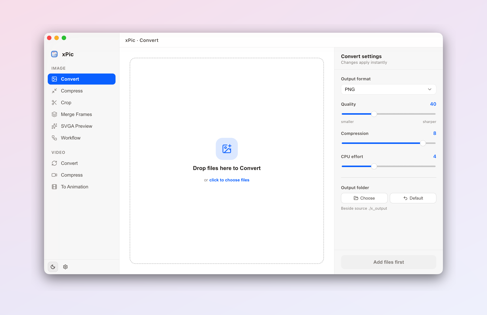

  

<h1 align="center">xPic</h1>

A simple, powerful desktop toolbox for images — convert, compress, crop and more. For macOS (Apple Silicon &amp; Intel) and Windows.

  <a href="https://github.com/Xheldon/xPic/releases/latest"><b>⬇️ Download</b></a>
  ·
  <a href="https://xpic.xheldon.com">Website</a>
  ·
  <a href="https://xpic.xheldon.com/changelog">Changelog</a>
  ·
  <a href="./README.zh-CN.md">简体中文</a>

  <picture>
    <source media="(prefers-color-scheme: dark)" srcset="./assets/screenshot-dark-en.png" />
    
  </picture>

## Features

- **Convert** — JPG / PNG / WebP / AVIF / HEIC / GIF / TIFF and more, including animated images, in batches.
- **Compress** — batch compression with adjustable quality; animated webp / gif supported.
- **Crop & resize** — by ratio, freeform, fixed dimensions, or down to a target file size (quality is found automatically).
- **Merge frames** — stitch a sequence of images into an animated WebP / APNG with custom loop & frame delay.
- **SVGA preview** — play SVGA animation files right inside the app.
- **Video tools** — convert or compress videos, or turn them into GIF / WebP / APNG animations.
- **Workflow** — chain convert / compress / crop / merge into one pipeline and run it with a single click.
- **Local & private** — everything is processed on your machine; nothing is ever uploaded.

Light & dark themes, multiple accent colors, English & Chinese interface. Updates are checked automatically inside the app.

## Download

Grab the installer for your platform from the [latest release](https://github.com/Xheldon/xPic/releases/latest), or from the [website](https://xpic.xheldon.com) — it always points to the newest version.

## Feedback

Questions, bugs and ideas are welcome in [Issues](https://github.com/Xheldon/xPic/issues).
