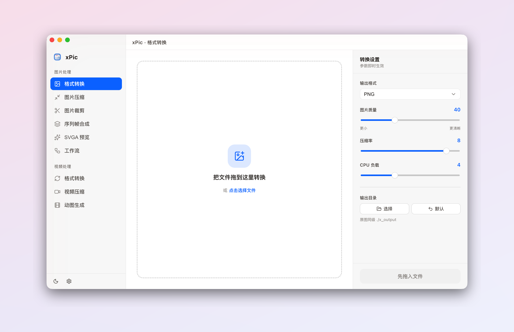

  

<h1 align="center">xPic</h1>

简洁强大的图片桌面工具箱——转换、压缩、裁剪,一应俱全。 支持 macOS(Apple 芯片 &amp; Intel)与 Windows。

  <a href="https://github.com/Xheldon/xPic/releases/latest"><b>⬇️ 下载</b></a>
  ·
  <a href="https://xpic.xheldon.com">官网</a>
  ·
  <a href="https://xpic.xheldon.com/changelog">更新日志</a>
  ·
  <a href="./README.md">English</a>

  <picture>
    <source media="(prefers-color-scheme: dark)" srcset="./assets/screenshot-dark-zh.png" />
    
  </picture>

## 功能

- **格式转换** — JPG / PNG / WebP / AVIF / HEIC / GIF / TIFF 等互转,支持动图与批量。
- **图片压缩** — 批量压缩、质量可调,webp / gif 动图同样能压。
- **裁剪缩放** — 按比例、自由框选、固定尺寸,或按目标文件大小自动找质量。
- **序列帧合成** — 多张图合成动态 WebP / APNG,循环次数与帧间隔可自定义。
- **SVGA 预览** — 在应用内直接播放 SVGA 动画文件。
- **视频处理** — 视频转换、压缩,或转成 GIF / WebP / APNG 动图。
- **工作流** — 把转换 / 压缩 / 裁剪 / 合成串成一条流水线,一键跑完。
- **本地 & 隐私** — 全部在你的电脑上处理,任何文件都不会被上传。

浅色 / 深色主题、多套强调色、中英双语界面,应用内自动检查更新。

## 下载

前往[最新版本](https://github.com/Xheldon/xPic/releases/latest)下载对应平台的安装包,或访问[官网](https://xpic.xheldon.com)——下载按钮永远指向最新版。

## 反馈

问题与建议欢迎提交 [Issues](https://github.com/Xheldon/xPic/issues)。
